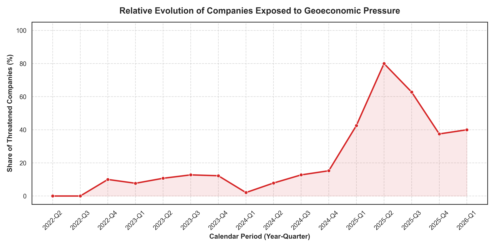
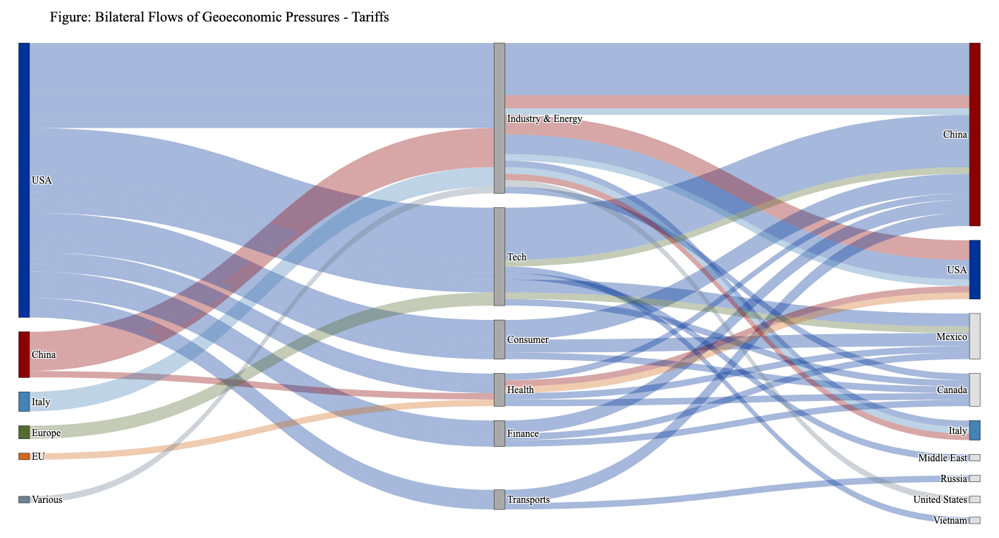
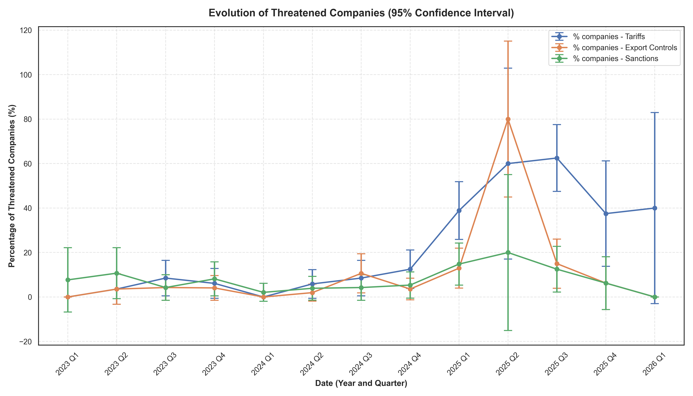

# Geoeconomic Pressure Analysis: Replication and Chokepoint Analysis

Research assistantship under the supervision of Pr. Gregory Corcos, Head of the Economics Department at Ecole Polytechnique

This repository contains all the code, data, and prompts documenting the replication of the methodology introduced by Clayton, Coppola, Maggiori, and Schreger (2025). The primary objective of this project is to systematically identify and quantify geoeconomic pressures (tariffs, export controls, and sanctions) exerted by governments, leveraging corporate earnings calls. The analysis specifically focuses on identifying "chokepoint" characteristics within global value chains.

The study leverages 530 earnings call transcripts from 99 major S&P 500 companies (across tech, finance, industry, etc.), retrieved using a custom scraping algorithm. The pipeline transforms these massive unstructured text corpora into structured datasets using Large Language Models (LLMs).

#### Important Note on Dataset Representativeness

Please note that the dataset obtained is not representative of global trade dynamics, as Chinese and third-party companies are missing from the scraped transcripts (which focus exclusively on US firms). Consequently, the graphs in the code and the report that may appear one-sided or incomplete must be interpreted accordingly. The primary goal of the following report and notebooks is to establish and validate a functioning analysis pipeline rather than to provide an exhaustive macroeconomic assessment.

## Project Architecture

The repository is organized as follows:

* **`Code/`**: Contains processing scripts and notebooks.
  * `Chokepoints_analysis_plots.ipynb` and `Paper_replication_plotting.ipynb`: Jupyter Notebooks responsible for metadata cleaning and visualization generation.
  * `Scraping_transcripts.py`: Script dedicated to extracting earnings call transcripts.
  * `Request_mistral.py`: Script handling requests to the secondary LLM API for data auditing.
* **`Data/`**: Stores raw and intermediate datasets.
  * `sp500_transcripts_history_full.csv`: Collected historical transcripts.
  * `results_final_flattened_0.csv` and `results_geoeconomics_analysis_precise.csv`: Structured results extracted by the LLMs.
  * `BACI_HS17_Y2018_V202601.csv` and associated nomenclature files for global trade flow analysis.
* **`Prompts/`**: Directory storing the textual instructions provided to the models.
  * Original Word documents (`Prompt_original_1.docx`, `Prompt_original_2.docx`) and Python implementations (`Prompts_clayton.py`, `Prompts_mistral.py`).
* **`outputs/`**: Target directory for exported charts (e.g., static PNG images).
* **`Geoeconomic_Pressure.pdf`**: The final analysis report detailing the replication's findings.

## Key Features

* **Two-Stage LLM Inference:** A first-stage prompt classifies documents to detect the presence of geoeconomic instruments, followed by a second-stage prompt that performs granular JSON extraction of actors (senders, receivers) and firm-level responses (supply chain readjustments, R&D)
* **Automated Hallucination Auditing:** A lighter secondary model (Mistral) independently validates the JSON outputs from the primary model to correct geographical and temporal hallucinations while keeping costs low[cite: 10]. Mistral also extracts the customs codes (HS2, HS4, HS6) associated with the targeted products
* **Metadata Processing & Enrichment:** Standardization of dates extracted from transcripts (via `dateutil.parser`) and assignment of companies to their respective economic sectors, filling in missing values via the `yfinance` API.
* **Advanced Analysis & Visualization:**
  * **Supply Chain Realignments:** Generation of interactive Sankey diagrams with `plotly` to illustrate pressure flows based on imposing countries, targeted sectors, and receiving countries.
  * **Sectoral Exposure:** Mapping of corporate presence over time using `seaborn` heatmaps.
  * **Temporal Evolution:** Evaluation of sample representativeness by calculating the Chi-Square p-value via `scipy`.
  * **Spatial Concentration Analysis:** Evaluation of U.S. import vulnerability by cross-referencing total trade value with the Herfindahl-Hirschman Index (HHI) of supplier concentration.

## Prerequisites & Dependencies

The code heavily relies on data analysis and plotting tools in Python:
* `pandas`, `numpy` (Data manipulation).
* `scipy` (Statistical analysis and Chi-Square tests).
* `matplotlib`, `seaborn`, `plotly` (Visualization generation).
* `yfinance` (Stock market and sectoral data enrichment).
* `python-dateutil` (Universal date parsing).
